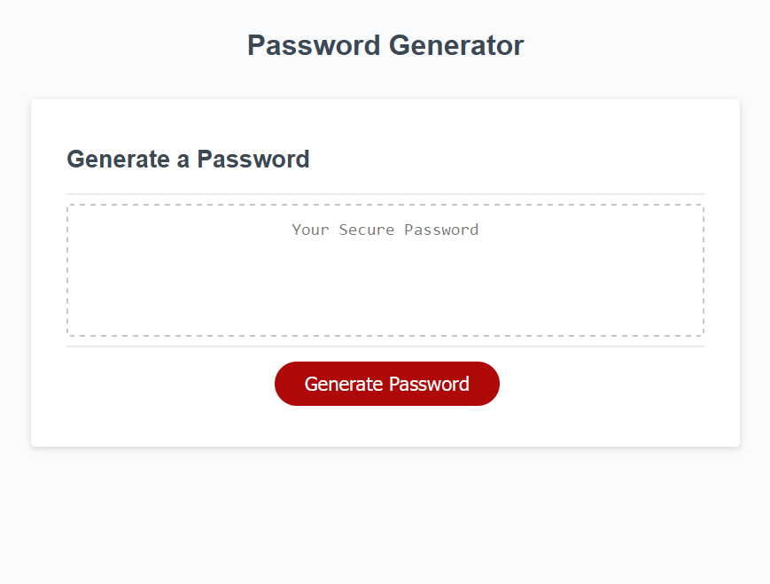

<MODULE3-PASSWORD-GENERATOR>
# A password generator

## Description:

A password generator that can add number, upper or lowercase letters, as well as some special characters.

[Try it out!]((#)

## Installation:

Simply git clone and do what youd like.

##Usage:

Will provide a live link so you can fiddle with it. Basically just press generate password, enter a length( between 8 and 128), confirm the options youd like, and 
voila! enjoy your new password.

##Credits:

Some starter code was provided: [repo link](https://github.com/coding-boot-camp/friendly-parakeet)
Everything else was done by me (Malik Kouyate/mkalik).
